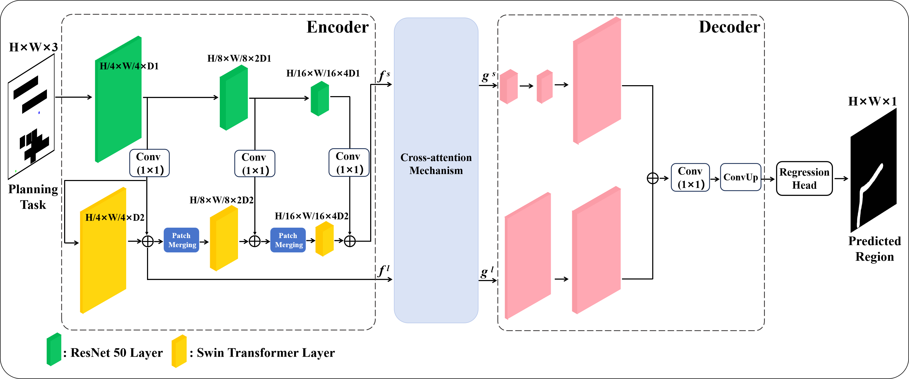

# **Our TG-Net code has been uploaded, and all the code is ready.**
# **You can simply run the train.py to quickly start the training of our net.**
# Dataset Instructions

The dataset file is split into 4 parts:
- Datasets.zip.001
- Datasets.zip.002
- Datasets.zip.003
- Datasets.zip.004

# TG-Net Instructions
The TG-Net file is split into 6 parts:
- TG-Net.zip.001
- TG-Net.zip.002
- TG-Net.zip.003
- TG-Net.zip.004
- TG-Net.zip.005
- TG-Net.zip.006
  
Usage:
1. Download all files
2. Use 7-Zip to open the first file (Datasets.zip.001/TG-Net.zip.001)
3. 7-Zip will automatically merge all parts and extract

*The network architecture of the TG-Net (revised).*
